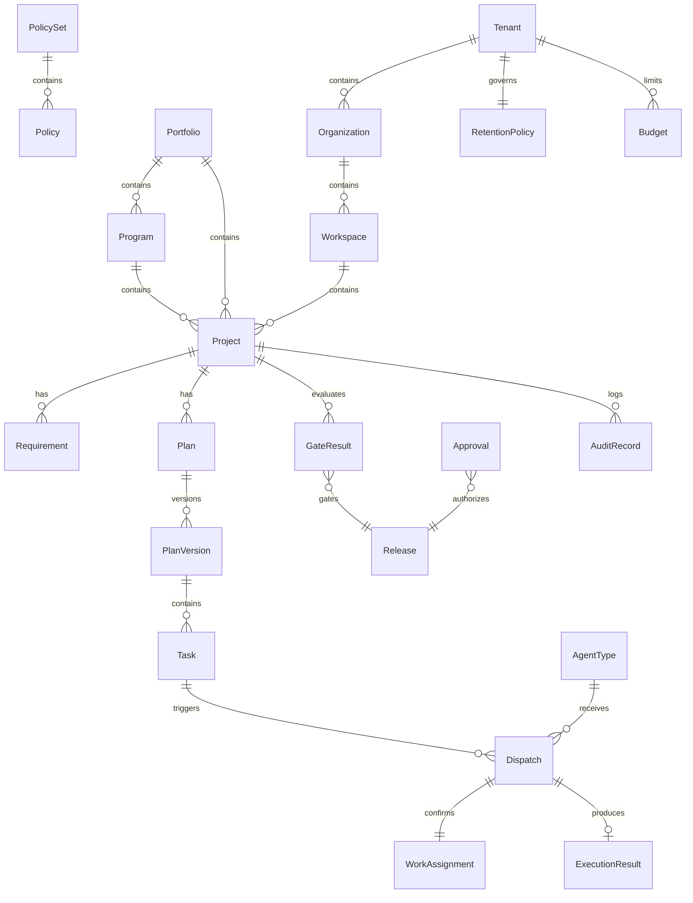

# Concept Relationship Map — EIM-AIPM-001

**Version:** 1.0.0 | **Status:** APPROVED

---

## Conceptual diagram

---

## Relationship catalog

| REL ID | From | To | Cardinality | Inverse | Description |
|--------|------|-----|-------------|---------|-------------|
| REL-001 | Tenant | Organization | 1:N | N:1 | Tenant owns organizations |
| REL-002 | Organization | Workspace | 1:N | N:1 | Org contains workspaces |
| REL-003 | Workspace | Project | 1:N | N:1 | Workspace scopes projects |
| REL-004 | Portfolio | Program | 1:N | N:1 | Portfolio groups programs |
| REL-005 | Portfolio | Project | 1:N | N:1 | Direct project roll-up |
| REL-006 | Program | Project | 1:N | N:1 | Program contains projects |
| REL-007 | Project | Initiative | 1:N | N:1 | Optional initiatives |
| REL-008 | Project | Requirement | 1:N | N:1 | Project requirements |
| REL-009 | Requirement | AcceptanceCriterion | 1:N | N:1 | Criteria per requirement |
| REL-010 | Project | Plan | 1:1 | 1:1 | One plan container |
| REL-011 | Plan | PlanVersion | 1:N | N:1 | Version history |
| REL-012 | PlanVersion | Task | 1:N | N:1 | Tasks in version |
| REL-013 | TaskNode | Dependency | N:N | N:N | DAG edges |
| REL-014 | PlanVersion | WorkSchedule | 1:N | N:1 | Schedules per activation |
| REL-015 | Task | Dispatch | 1:N | N:1 | Retries allowed |
| REL-016 | AgentType | Dispatch | 1:N | N:1 | Target workforce type |
| REL-017 | Dispatch | WorkAssignment | 1:1 | 1:1 | Assurance record |
| REL-018 | Dispatch | ExecutionResult | 1:0..1 | 0..1:1 | Outcome |
| REL-019 | Tenant | PolicySet | 1:N | N:1 | Tenant policies |
| REL-020 | PolicySet | Policy | 1:N | N:1 | Policy membership |
| REL-021 | User | Approval | 1:N | N:1 | Approver |
| REL-022 | Approval | Release | N:N | N:N | Release gates |
| REL-023 | GateResult | Release | 1:N | N:1 | Quality evidence |
| REL-024 | Project | TraceLink | 1:N | N:1 | Traceability |
| REL-025 | Task | TraceLink | 1:N | N:1 | Work trace |
| REL-026 | Dispatch | ContextPackage | 1:1 | 1:1 | Context per dispatch |
| REL-027 | Tenant | Connection | 1:N | N:1 | Integrations |
| REL-028 | Connection | ExternalWorkItem | 1:N | N:1 | Synced tickets |
| REL-029 | Project | CostRecord | 1:N | N:1 | Cost attribution |
| REL-030 | Tenant | Budget | 1:N | N:1 | Budget limits |
| REL-031 | Project | AuditRecord | 1:N | N:1 | Audit scope |
| REL-032 | Tenant | LegalHold | 1:N | N:1 | Holds |
| REL-033 | Incident | Task | 1:N | N:1 | Remediation work |
| REL-034 | Halt | Tenant | N:1 | 1:N | Scoped halt |
| REL-035 | Credential | AgentInstance | 1:N | N:1 | Issued credentials |

---

## Ownership matrix (authoritative source)

| Concept | System of record owner |
|---------|------------------------|
| CON-008 Project | AIPM (ADR-005) |
| CON-044 ExternalWorkItem | Bidirectional sync; AIPM authoritative for orchestration state |
| CON-045 Repository | External VCS; AIPM holds reference only |
| CON-053 AuditRecord | AIPM append-only |
| CON-027 Artifact | Workforce produces; AIPM registers metadata |
