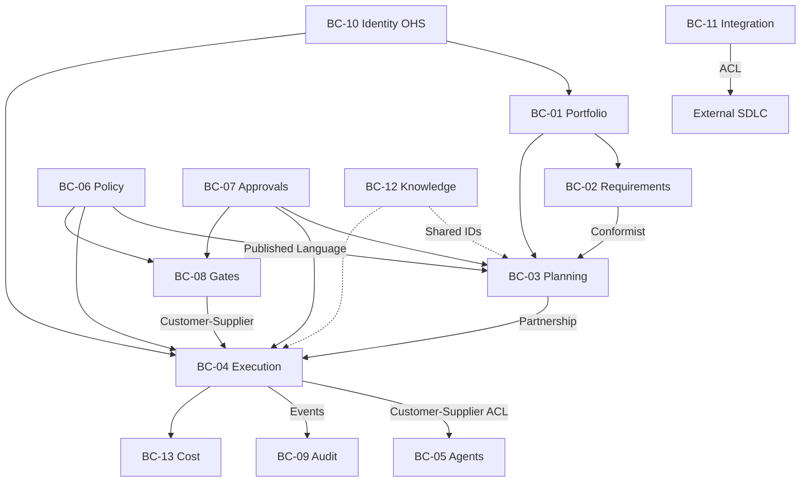

# AI Project Manager — Domain Model

**Document ID:** DM-AIPM-001  
**Product:** AI Project Manager (AIPM)  
**Version:** 1.0.0  
**Classification:** Enterprise Domain Specification  
**Date:** 2026-07-07  
**Location:** `Engineering-Blueprint/06-Domain-Model/`  
**Status:** APPROVED

**Parent documents (LOCKED — not modified):**

| Document | ID | Version |
|----------|-----|---------|
| Enterprise Information Model | EIM-AIPM-001 | 1.0.0 APPROVED |
| Business Capability Model | BCM-AIPM-001 | 1.0.0 APPROVED |
| SRS | SRS-AIPM-001 | 1.0.0 LOCKED |
| SAD | SAD-AIPM-001 | 1.0.0 APPROVED |
| Constitution | PC-AIPM-001 | 1.0.0 APPROVED |

**Governance:** [ADR-GOV-007](../02-Architecture/ADR/ADR-GOV-007-domain-stability-rule.md) — this model is **frozen** after approval.

---

## 1. Executive Summary

DM-AIPM-001 is the **canonical business model** of the AI Project Manager platform. It specifies strategic and tactical domain design across **15 bounded contexts**, **30 aggregates**, **commands**, **domain events**, **policies**, and **invariants**—with full traceability to EIM concepts (CON-###), capabilities (CAP-###), and SRS requirements.

This document describes **only the business domain**. No databases, APIs, programming languages, frameworks, or infrastructure appear here.

**Artifact set:** [Bounded-Contexts.md](Bounded-Contexts.md) · [Aggregate-Catalog.md](Aggregate-Catalog.md) · [Domain-Tactical-Catalog.md](Domain-Tactical-Catalog.md) · [Commands-Events-Catalog.md](Commands-Events-Catalog.md)

---

## 2. Domain Vision

AIPM governs autonomous software delivery as a **trusted control plane**: intent becomes plan, plan becomes scheduled work, work is delegated to certified specialist workforce under policy, outputs are validated, quality gates and human approvals control release, and every material action produces audit evidence.

The domain exists to make **safe, measurable, accountable delivery** the default—not to generate customer application source code (PC §2, CON-001).

---

## 3. Domain Mission

Coordinate the full delivery lifecycle—requirements, planning, execution, governance, quality, integration, knowledge, cost, and operations—while preserving tenant isolation, human sovereignty, and fail-closed policy enforcement.

---

## 4. Ubiquitous Language

Canonical terms align with [Domain-Glossary.md](Domain-Glossary.md) and EIM-AIPM-001. Key distinctions enforced in this model:

| Term | Domain meaning |
|------|----------------|
| **Dispatch** | Control-plane delegation of Task to AgentType; not code execution |
| **Task** | Delegable unit of work; distinct from **TaskNode** (plan structure) |
| **PlanVersion** | Immutable planning snapshot; one active baseline |
| **Approval** | Human authorization; distinct from **Policy** machine evaluation |
| **AuditRecord** | Immutable fact; distinct from **ExplainabilityRecord** (rationale) |
| **Release** | Authorized production promotion |

---

## 5. Core Domain

Highest business differentiation—the reason AIPM exists:

| Subdomain | Bounded contexts | Aggregates |
|-----------|------------------|------------|
| **Delivery orchestration** | BC-04 Scheduling & Execution | AGG-008 Task, AGG-009 WorkSchedule, AGG-010 Dispatch, AGG-011 Halt |
| **Governed delegation** | BC-05 Agent Management, BC-06 Policy | AGG-012 AgentType, AGG-013 AgentInstance, AGG-014 PolicySet |
| **Human accountability** | BC-07 Approvals, BC-08 Quality Gates | AGG-015 Approval, AGG-016 GateDefinition, AGG-017 Release |

---

## 6. Supporting Domains

| Subdomain | BC | Role |
|-----------|-----|------|
| Portfolio & delivery structure | BC-01 | Project, Program, Portfolio hierarchy |
| Intent & requirements | BC-02 | Requirement, traceability |
| Planning | BC-03 | Plan, PlanVersion, TaskNode graph |
| Integration | BC-11 | External SDLC alignment |
| Knowledge | BC-12 | Context for delegation |
| Cost | BC-13 | Budget enforcement |
| Operations | BC-04, BC-14 | Halt, notifications |

---

## 7. Generic Domains

| Subdomain | BC | Role |
|-----------|-----|------|
| Identity & access | BC-10 | Tenant, User, Role |
| Audit & compliance | BC-09 | AuditRecord, EvidencePackage |
| Analytics | BC-15 | Read-only projections (no mutable aggregates) |

---

## 8. Subdomains Map

```
Core:        Orchestration · Workforce · Policy · Approval · Quality
Supporting:  Portfolio · Requirements · Planning · Integration · Knowledge · FinOps
Generic:     Identity · Audit · Analytics (read)
```

---

## 9. Context Map



Detail: [Bounded-Contexts.md](Bounded-Contexts.md).

---

## 10. Context Relationships Summary

| Upstream | Downstream | Pattern |
|----------|------------|---------|
| BC-10 Identity | All | Open Host Service (authz) |
| BC-01 Portfolio | BC-02, BC-03 | Upstream/Downstream |
| BC-02 Requirements | BC-03 Planning | Conformist |
| BC-03 Planning | BC-04 Execution | Partnership |
| BC-04 Execution | BC-05 Agents | Customer-Supplier + ACL |
| BC-06 Policy | BC-03, BC-04, BC-08 | Published Language |
| BC-07 Approvals | BC-03, BC-04, BC-08 | Partnership |
| BC-08 Gates | BC-04 | Customer-Supplier |
| BC-11 Integration | External | Anti-Corruption Layer |
| BC-12 Knowledge | BC-03, BC-04 | Shared Kernel (IDs only) |
| BC-06 Policy | LLM providers | Separate Ways |

---

## 11. Domain Boundaries

| Inside domain | Outside domain |
|---------------|----------------|
| Orchestration, governance, evidence | Customer application code generation (PM core) |
| Workforce coordination | Agent-internal reasoning |
| Integration awareness | External tool business logic |
| Authoritative delivery state | Authoritative external PM when configured read-only |

---

## 12. Aggregate Index

| AGG | Name | BC | Root CON |
|-----|------|-----|----------|
| AGG-001 | Tenant | BC-10 | CON-001 |
| AGG-002 | Portfolio | BC-01 | CON-006 |
| AGG-003 | Program | BC-01 | CON-007 |
| AGG-004 | Project | BC-01 | CON-008 |
| AGG-005 | Requirement | BC-02 | CON-013 |
| AGG-006 | Plan | BC-03 | CON-016 |
| AGG-007 | PlanVersion | BC-03 | CON-017 |
| AGG-008 | Task | BC-04 | CON-018 |
| AGG-009 | WorkSchedule | BC-04 | CON-023 |
| AGG-010 | Dispatch | BC-04 | CON-024 |
| AGG-011 | Halt | BC-04 | CON-028 |
| AGG-012 | AgentType | BC-05 | CON-029 |
| AGG-013 | AgentInstance | BC-05 | CON-030 |
| AGG-014 | PolicySet | BC-06 | CON-033 |
| AGG-015 | Approval | BC-07 | CON-036 |
| AGG-016 | GateDefinition | BC-08 | CON-038 |
| AGG-017 | Release | BC-08 | CON-042 |
| AGG-018 | AuditRecord | BC-09 | CON-053 |
| AGG-019 | EvidencePackage | BC-09 | CON-055 |
| AGG-020 | Connection | BC-11 | CON-043 |
| AGG-021 | ExternalWorkItem | BC-11 | CON-044 |
| AGG-022 | KnowledgeItem | BC-12 | CON-048 |
| AGG-023 | Budget | BC-13 | CON-057 |
| AGG-024 | CostRecord | BC-13 | CON-056 |
| AGG-025 | Notification | BC-14 | CON-061 |

Full definitions: [Aggregate-Catalog.md](Aggregate-Catalog.md).

---

## 13. Domain Purity Audit

| Check | Result |
|-------|--------|
| No database terminology | **PASS** |
| No API terminology | **PASS** |
| No programming language references | **PASS** |
| No framework references | **PASS** |
| No infrastructure references | **PASS** |
| No implementation details | **PASS** |

---

## 14. Traceability Audit

| Check | Result |
|-------|--------|
| Every AGG → CON + CAP | **PASS** |
| Every CMD → CAP + CON + AGG | **PASS** |
| Every EVT originates from AGG | **PASS** |
| Every BC → SAD BC-01–15 | **PASS** |
| MOD mapping complete | **PASS** — [Domain-Traceability-Matrix.md](Domain-Traceability-Matrix.md) |

---

## 15. Quality Gate Record

QG-01 through QG-11: **PASS** (see DQG-AIPM-001).

---

## References

- EIM-AIPM-001, BCM-AIPM-001, ADR-GOV-003–007
- SAD §12–13 (bounded contexts, context map)

---

**DOMAIN MODEL STATUS: APPROVED**

**Frozen per ADR-GOV-007.** Changes require ADR.
