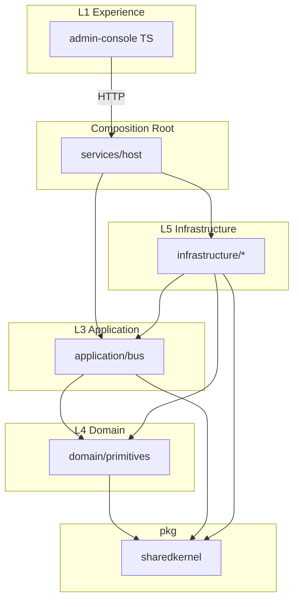

# AI Project Manager — Implementation Architecture (Phase 1)

**Document ID:** IAD-AIPM-PH1-001  
**Product:** AI Project Manager (AIPM)  
**Version:** 1.1.0  
**Runtime authority:** [ADR-TECH-001](../02-Architecture/ADR/ADR-TECH-001-Approved-Technology-Stack.md) — **C# / .NET 9 / ASP.NET Core 9** (supersedes Go references in v1.0.0)
**Classification:** Implementation Architecture  
**Date:** 2026-07-07  
**Location:** `Engineering-Blueprint/16-Implementation/Implementation-Architecture-Phase1.md`  
**Status:** APPROVED

**Role:** Chief Software Architect · Principal AI Engineer · Lead Backend · Lead DevOps · Technical Reviewer

**Locked parents (not modified):**

| Document | ID | Status |
|----------|-----|--------|
| SRS | SRS-AIPM-001 | LOCKED |
| SAD | SAD-AIPM-001 | APPROVED |
| Constitution | PC-AIPM-001 | APPROVED |
| BCM | BCM-AIPM-001 | APPROVED |
| EIM | EIM-AIPM-001 | APPROVED |
| Domain Model | DM-AIPM-001 | APPROVED — FROZEN |
| ADRs | ADR-001–008, ADR-SAD-001–010, ADR-GOV-001–007, **ADR-TECH-001** | Accepted / LOCKED |

**Phase scope:** Foundation platform only. **No** Requirements, Planning, Developer Agents, or business use-case implementation.

---

## Executive Summary

Phase 1 delivers the **runnable skeleton** of the AIPM control plane: monorepo layout, Clean Architecture layers, dependency rules, configuration, logging, errors, DI, plugin discovery, message bus, workflow engine skeleton, agent runtime contract, observability, CI/CD, and testing harness—ready for Phase 2 bounded-context implementation.

**Primary control-plane language (Phase 1):** **C# / .NET 9 / ASP.NET Core 9** per [ADR-TECH-001](../02-Architecture/ADR/ADR-TECH-001-Approved-Technology-Stack.md) and [TAD-AIPM-001](../24-Standards/Technology-Architecture.md). Next.js admin shell (Phase 1 stub later). **No Go. No Python control plane.**

---

## 1. Repository Layout

Physical monorepo at repository root (sibling to `Engineering-Blueprint/`):

```text
Project Manager/
├── Engineering-Blueprint/          # LOCKED specifications (no app code)
│
├── .github/
│   └── workflows/                  # CI/CD pipelines
│
├── build/
│   ├── docker/                     # Dockerfiles per deployable
│   └── ci/                         # Pipeline scripts, linters config
│
├── deploy/
│   ├── kubernetes/                 # Kustomize bases (DU-1..5 stubs)
│   ├── helm/                       # Optional Helm charts
│   └── profiles/                   # SaaS | Dedicated | AirGapped flags (ADR-SAD-005)
│
├── docs/
│   └── implementation/             # Generated API docs, runbooks (links to Blueprint)
│
├── scripts/
│   └── dev-up.ps1                  # Local stack bootstrap (Docker Compose)
│
├── src/
│   ├── AIPM.sln
│   │
│   ├── AIPM.SharedKernel/          # IDs, tenant context, errors, Result
│   ├── AIPM.Domain/                # L4 primitives only (no business aggregates)
│   ├── AIPM.Application/             # MediatR, pipeline, ports
│   ├── AIPM.Infrastructure/        # L5 — Serilog, OTel, PG, Redis, RabbitMQ, DI extensions
│   ├── AIPM.Plugins/               # Plugin manifest + scanner
│   ├── AIPM.Workflow/              # FSM skeleton (ADR-SAD-002)
│   └── AIPM.Host/                  # ASP.NET Core composition root
│
├── tests/
│   ├── AIPM.SharedKernel.Tests/
│   ├── AIPM.Architecture.Tests/    # NetArchTest dependency rules
│   └── AIPM.Host.Tests/
│
├── apps/
│   └── admin-console/              # Next.js (M6 — not M1)
│
├── deploy/
│   └── docker/
│       └── docker-compose.yml      # PostgreSQL, Redis, RabbitMQ, MinIO
│
├── Directory.Build.props           # Repo-wide MSBuild settings
├── Directory.Packages.props        # Central package versions
├── global.json                     # .NET SDK pin (9)
```

**Traceability:** SAD §7 Layered Architecture (L1–L6), ADR-SAD-001 (five DUs staged from `services/host`).

---

## 2. Solution Structure

### 2.1 .NET solution projects

| Project | Layer | DU (future) | Responsibility |
|---------|-------|-------------|----------------|
| `AIPM.SharedKernel` | Cross-cutting | All | `TenantId`, entity IDs, `DomainError`, `Result`, correlation IDs |
| `AIPM.Infrastructure` (observability) | L5 cross-cutting | All | Serilog, OpenTelemetry traces/metrics |
| `AIPM.Host` (configuration) | L5 | All | `appsettings` + env, feature flags, profile flags (ADR-SAD-005) |
| `AIPM.Infrastructure` (messaging) | L5 | All | `IMessageBus`, MassTransit, envelope, serialization |
| `AIPM.Plugins` | L6 boundary | DU-2/4 | Manifest schema, plugin discovery, version compatibility |
| `AIPM.SharedKernel.Tests` | Test | All | Test utilities, tenant test context |
| `AIPM.Domain` | L4 | All | `AggregateRoot`, `IDomainEvent` bases; **no business aggregates** |
| `AIPM.Application` | L3 | All | MediatR commands/queries, pipeline behaviors |
| `AIPM.Infrastructure` | L5 | DU-2/3 | Persistence ports, migration interface, health checks |
| `AIPM.Workflow` | L4/L3 | DU-2 | Generic FSM engine for future SM-### |
| `agent/sdk` | L6 | DU-2 | Agent manifest, lifecycle hooks, health report types |
| `agent/registry` | L3/L5 | DU-2 | `AgentType` catalog port (no real agents Phase 1) |
| `services/host` | Host | DU-1+2+3 bootstrap | Composition root, HTTP `/health`, `/ready`, startup |
| `services/cli` | Tool | Ops | `aipmctl` for local dev, config validate, plugin list |
| `tools/archlint` | Tool | CI | Enforces dependency graph |

### 2.2 TypeScript — `apps/admin-console`

| Project | Responsibility |
|---------|----------------|
| `admin-console` | L1 shell: auth placeholder, layout, health dashboard calling host API; **no business screens** |

### 2.3 Python — `analytics/projection-worker`

| Project | Responsibility |
|---------|----------------|
| `projection-worker` | Isolated DU-5 stub: consume heartbeat topic, expose `/health`; **no projections** |

### 2.4 Explicitly excluded from Phase 1

| Excluded | Phase |
|----------|-------|
| `project-service`, `plan-service`, `dispatch-service` business logic | Phase 2+ |
| Requirements / planning / developer agent plugins | Phase 3+ |
| Production Kafka cluster wiring | Phase 2 (interface only Phase 1) |
| Full DU split deployments | Phase 2 (single host Phase 1) |

---

## 3. Dependency Graph

### 3.1 Allowed references (Go)

```text
services/host  →  application, infrastructure, domain, pkg, workflow, agent
services/cli   →  application, infrastructure, pkg, agent/sdk

application    →  domain, pkg
domain         →  pkg/sharedkernel ONLY
infrastructure →  domain, application, pkg
workflow       →  domain, pkg
agent/sdk      →  pkg/sharedkernel
agent/registry →  domain/ports, pkg, agent/sdk
pkg/*          →  stdlib + approved third-party only (no domain)

apps/admin-console  →  host HTTP API only (no Go imports)
analytics/*         →  messaging contracts via schema/JSON only (no Go imports)
```

### 3.2 Forbidden dependencies (enforced by `archlint` + CI)

| From | Must NOT import |
|------|-----------------|
| `domain/*` | `infrastructure`, `application`, `services`, `agent`, HTTP/DB drivers |
| `application/*` | `services/host`, concrete DB drivers |
| `pkg/*` | `domain`, `application`, `infrastructure`, `services` |
| `agent/sdk` | `domain` business, `infrastructure` |
| Any layer | Skipping layers (L4→L6 direct) per SAD §7 |

### 3.3 Diagram



**Traceability:** SAD §7 dependency rule; PC §3 Clean Architecture; ADR-GOV-007 (domain frozen).

---

## 4. Package Strategy

### 4.1 C# / .NET — approved packages

| Package | Purpose | ADR / SAD |
|---------|---------|-----------|
| `Serilog` + `Serilog.AspNetCore` | Structured logging | PC §4 observable-first |
| `OpenTelemetry.*` | Traces, metrics | NFR-015, SAD observability |
| ASP.NET Core Minimal APIs | HTTP host, routing | DU-1 edge routing |
| `Microsoft.Extensions.DependencyInjection` | Built-in DI | Testability, explicit graph |
| `MassTransit` + `MassTransit.RabbitMQ` | Message bus abstraction | ADR-SAD-004 |
| `Npgsql` | PostgreSQL driver (Phase 2 migrations) | ADR-SAD-003 prep |
| `FluentMigrator` or EF Core migrations | Schema migrations | Phase 2 |
| `Microsoft.Extensions.Configuration` | Env + file config | 12-factor config |
| `MediatR` | CQRS command/query bus | TAD §20 |
| `xUnit` + `FluentAssertions` | Test assertions | PC §4 testable |
| `NetArchTest.Rules` | Architecture tests | PC §3 fitness functions |
| `System.Guid` | UUID generation | EIM VO IDs |

**Rejected Phase 1:** Heavy ORM in domain, service locator anti-pattern, direct Kafka client in domain.

**Superseded:** v1.0.0 Go packages (`wire`, `watermill`, `chi`) — do not use.

### 4.2 TypeScript

| Package | Purpose |
|---------|---------|
| `vite` + `react` | Admin shell build |
| `@tanstack/react-query` | API data fetching |
| `typescript` strict | Type safety |

### 4.3 Python

| Package | Purpose |
|---------|---------|
| `pydantic` | Config + message validation |
| `opentelemetry-api` | Trace propagation |
| `httpx` | Health endpoints |

---

## 5. Configuration Strategy

### 5.1 Layers

| Layer | Source | Example |
|-------|--------|---------|
| Defaults | Code | Safe dev defaults |
| Profile | `deploy/profiles/{saas,dedicated,airgapped}.yaml` | ADR-SAD-005 |
| Environment | `AIPM_*` env vars | `AIPM_ENV=development` |
| Secrets | Vault / K8s secrets | DB URL, API keys (ADR-SAD-010) |
| Feature flags | Config service / env | `AIPM_FEATURE_DISPATCH=false` |

### 5.2 Structure

```yaml
# config schema (conceptual)
service:
  name: aipm-host
  env: development
server:
  http_port: 8080
  shutdown_timeout: 30s
tenant:
  require_tenant_header: true    # ADR-SAD-006
observability:
  log_level: info
  trace_exporter: otlp
messaging:
  driver: inmemory              # Phase 1; kafka Phase 2
  topic_prefix: aipm
plugins:
  scan_paths: ["./plugins"]
  allow_unsigned_dev: true      # false in production
workflow:
  durable_driver: memory        # postgres Phase 2
secrets:
  provider: env                 # vault Phase 2
```

### 5.3 Secrets management

| Environment | Provider |
|-------------|----------|
| Local dev | `.env` (gitignored), never committed |
| CI | GitHub Actions secrets |
| Production | Vault/KMS via `infrastructure/secrets` (DU-3) |

**Rule:** No secrets in Blueprint or source. PC §8.

### 5.4 Feature flags

- Interface: `pkg/configuration.FeatureFlags`
- Phase 1 flags: `platform.readiness`, `plugins.discovery`, `messaging.kafka`
- All business flags default **off** until Phase 2+

---

## 6. Logging Strategy

### 6.1 Standards

| Field | Required |
|-------|----------|
| `timestamp` | ISO 8601 UTC (NFR-017) |
| `level` | debug/info/warn/error |
| `message` | Human-readable |
| `service.name` | Deployable name |
| `trace_id`, `span_id` | OpenTelemetry correlation |
| `tenant_id` | When in request context (ADR-SAD-006) |
| `correlation_id` | Request/command ID |

### 6.2 Implementation

- **Library:** `log/slog` JSON handler to stdout
- **Wrapper:** `pkg/observability.Logger` injects context fields
- **Middleware:** `application/pipeline.Logging` on command bus and HTTP
- **PII:** Never log secrets, tokens, or raw PII (NFR-008, PC §9)

### 6.3 Log levels by environment

| Env | Default level |
|-----|---------------|
| development | debug |
| staging | info |
| production | info (warn for security events) |

---

## 7. Error Handling Strategy

### 7.1 Error taxonomy (`pkg/sharedkernel`)

| Type | Use | HTTP mapping |
|------|-----|--------------|
| `ValidationError` | Input/domain rule violation | 400 |
| `NotFoundError` | Missing aggregate | 404 |
| `ConflictError` | Concurrency, duplicate | 409 |
| `UnauthorizedError` | Auth failure | 401 |
| `ForbiddenError` | Policy deny (fail-closed) | 403 |
| `InfrastructureError` | DB, bus, external | 503 |
| `InternalError` | Unexpected | 500 (sanitized body) |

### 7.2 Global handling

- **HTTP:** RFC 7807 `application/problem+json` via `infrastructure/httpx`
- **Command bus:** `pipeline.Recover` middleware catches panic → `InternalError` + audit hook placeholder
- **Policy:** Fail-closed → `ForbiddenError`, never silent permit (ADR-SAD-009, PC §25)
- **Wrapping:** `%w` chain preserved; domain errors do not import HTTP types

### 7.3 No silent failures

Per PC §4: every error logged with correlation ID; metrics counter `aipm_errors_total{type}`.

---

## 8. Dependency Injection Strategy

### 8.1 Composition root

- **Single root:** `services/host/internal/bootstrap`
- **Tool:** `google/wire` for compile-time graph
- **No service locator** in domain or application

### 8.2 Lifetime rules

| Component | Lifetime |
|-----------|----------|
| Logger, Config, OTel providers | Singleton |
| HTTP handlers, Command handlers | Singleton |
| `UnitOfWork` | Scoped per command/request |
| Repositories | Scoped per UoW |
| Message publisher | Singleton |
| Clock | Singleton (replaceable in tests) |

### 8.3 Registration phases

1. **Infrastructure** — config, log, trace, bus, secrets, clock
2. **Application** — bus, middleware pipeline
3. **Domain ports** — stub repository implementations (in-memory Phase 1)
4. **HTTP** — routes, health, readiness
5. **Background** — bus subscribers, graceful shutdown hooks

### 8.4 Testing

- Wire `test` build tag or manual constructor for swapping in-memory adapters
- No global mutable state

---

## 9. Plugin System

### 9.1 Purpose

Discover and load **AgentType** plugins (ADR-007, CON-029, AGG-012) without core forks (CON-006).

### 9.2 Phase 1 scope

| Component | Deliverable |
|-----------|-------------|
| Manifest schema | `agent/sdk/manifest.v1.json` contract |
| Loader interface | `pkg/plugins.Loader` |
| Registry port | `agent/registry.Catalog` |
| Discovery | Scan `plugins/` directory; validate manifest only |
| **No** executable agent loading | Phase 3 |

### 9.3 Manifest fields (minimum)

```json
{
  "agent_type_id": "string",
  "version": "semver",
  "capabilities": ["string"],
  "entrypoint": "optional Phase 3",
  "certification_required": true,
  "signature": "optional prod"
}
```

### 9.4 Discovery flow

1. Host startup → `PluginScanner` reads configured paths
2. Validate manifest against JSON schema + `archlint` rules
3. Register metadata in `AgentRegistry` (in-memory)
4. Expose `GET /v1/agent-types` (catalog only, no dispatch)

### 9.5 Security

- Unsigned plugins allowed **dev only** (`allow_unsigned_dev`)
- Production requires certification flag + signature verification (Phase 3)
- Plugins run isolated runtimes (ADR-007) — not in-process Phase 3+

**Traceability:** CAP-018, CAP-022, MOD-07, PC §28.

---

## 10. Workflow Engine Skeleton

Per ADR-SAD-002: **embedded FSM + durable adapter**.

### 10.1 Components

| Package | Role |
|---------|------|
| `workflow/fsm` | Generic `StateMachine<S,E>` with guarded transitions |
| `workflow/fsm/definition` | Declarative transition table loader (YAML/Go) |
| `workflow/durable` | `DurableWorkflowPort` — persist instance, resume, cancel |
| `workflow/durable/memory` | Phase 1 in-memory implementation |

### 10.2 FSM interface (conceptual)

```go
// Conceptual — not shipped code in this document
type StateMachine interface {
    CurrentState() StateID
    Fire(event EventID, ctx Context) (TransitionResult, error)
    AllowedEvents() []EventID
}
```

### 10.3 Linkage to blueprint

- Transitions will map to `CMD-###` / `EVT-###` / `SM-###` (folder `08-State-Machines` — future)
- Phase 1: single demo FSM `PlatformLifecycle` (Starting → Ready → Draining → Stopped) for host only
- **No** Task, Plan, or Dispatch state machines

### 10.4 Durable adapter (Phase 2)

- Backed by PostgreSQL or workflow engine adapter
- Idempotent transition writes
- Correlation with `EVT-###` outbox pattern

---

## 11. Agent Runtime

Per ADR-007: PM orchestrates; agents in **isolated runtimes**.

### 11.1 Lifecycle (design)

```text
Register → Certify → Idle → Assigned → Executing → Reporting → Completed | Failed
                              ↓
                           Revoked (on Halt)
```

### 11.2 Phase 1 deliverables

| Artifact | Content |
|----------|---------|
| `agent/sdk/lifecycle.go` | State enum, health heartbeat struct |
| `agent/sdk/manifest.go` | Manifest types |
| `agent/registry/catalog.go` | In-memory catalog |
| HTTP | `POST /v1/agents/heartbeat` (stub accepts, logs) |

### 11.3 Not in Phase 1

- Dispatch protocol implementation
- mTLS agent channels (ADR-SAD-007) — interface documentation only
- Credential broker (ADR-SAD-010) — Phase 2

### 11.4 Traceability

CON-029–032, AGG-012–013, CAP-018–019, EVT-090–091, ADR-007.

---

## 12. Message Bus

Per ADR-SAD-004: log-based backbone with abstraction.

### 12.1 Abstractions (`pkg/messaging`)

| Interface | Responsibility |
|-----------|----------------|
| `Publisher` | Publish domain envelope to topic |
| `Subscriber` | Subscribe with consumer group |
| `Envelope` | `event_id`, `event_type`, `tenant_id`, `payload`, `occurred_at`, `trace_ctx` |
| `Outbox` | Transactional outbox port (Phase 2) |

### 12.2 Topic naming

```text
aipm.{tenant_id}.{domain}.{event_type}   # business (Phase 2+)
aipm.platform.{event_type}                # platform events Phase 1
```

### 12.3 Phase 1 implementation

- **Driver:** MassTransit in-memory (tests/CI) or RabbitMQ (local Docker)
- **MassTransit** adapter for Kafka at scale (Phase 2+)
- **No business events published** — only `PlatformStarted`, `HealthCheckPassed`

### 12.4 Rules

- Domain layer emits via application services only
- Handlers idempotent (NFR event processing)
- Schema versioning reserved for `07-Domain-Events` catalog

---

## 13. Project Startup Sequence

### 13.1 `AIPM.Host` boot order

| Step | Action | Failure behavior |
|------|--------|------------------|
| 1 | Load `appsettings` + validate profile | Exit 1, log fatal |
| 2 | Initialize Serilog + OpenTelemetry | Exit 1 |
| 3 | Register ASP.NET Core DI graph | Exit 1 |
| 4 | Connect secrets provider (env) | Exit 1 |
| 5 | Initialize MassTransit (in-memory or RabbitMQ) | Exit 1 |
| 6 | Run database migration check (noop Phase 1) | Warn only |
| 7 | Scan plugins → register manifests | Warn on invalid; fail if strict mode |
| 8 | Start FSM → state `Ready` | Exit 1 |
| 9 | Register HTTP routes + middleware | — |
| 10 | Start HTTP server | — |
| 11 | Start bus consumers (platform only) | — |
| 12 | Publish `EVT-PlatformStarted` | — |
| 13 | Mark readiness `/ready` → 200 | — |

### 13.2 Shutdown (graceful)

1. Receive SIGTERM
2. FSM → `Draining`
3. Stop accepting HTTP (readiness → 503)
4. Drain bus consumers (timeout `shutdown_timeout`)
5. Flush telemetry
6. FSM → `Stopped`
7. Exit 0

### 13.3 Health endpoints

| Path | Purpose |
|------|---------|
| `GET /health` | Liveness — process up |
| `GET /ready` | Readiness — bus + FSM Ready |
| `GET /version` | Build version, git sha, profile |

---

## 14. Coding Standards

Document: `Engineering-Blueprint/24-Standards/Coding-Standards-Phase1.md` (summary below).

### 14.1 General

| Rule | Detail |
|------|--------|
| Traceability | PR must cite CAP/CON/AGG or IAD section |
| No new domain concepts | ADR-GOV-007 |
| Language | **C# / .NET 9** control plane; Next.js UI (M6); analytics workers isolated |
| Format | `dotnet format`, `eslint` (M6+) |
| Commits | Conventional commits `feat(host):`, `chore(ci):` |

### 14.2 C#

- Project per layer, then bounded context folder (Phase 2+)
- Interfaces defined by consumer
- `CancellationToken` on async handlers
- Errors: `Result` / `DomainError`; no unhandled exceptions in production path
- Tests: xUnit + FluentAssertions; NetArchTest for dependency rules
- XML documentation on all public APIs
- Nullable reference types enabled; analyzers on; warnings as errors in CI

### 14.3 Domain rules (when implemented Phase 2+)

- Aggregates enforce invariants; no public setters
- Commands change state; queries do not
- Domain events raised inside aggregate
- `tenant_id` on every tenant-scoped operation

### 14.4 AI coding agent rules

- Must read `DM-AIPM-001` before implementing BC
- Must not add aggregates without ADR
- Must run `make verify` before PR
- Must not import forbidden packages (archlint)

---

## 15. Testing Strategy

### 15.1 Pyramid

| Layer | Tool | Phase 1 focus |
|-------|------|---------------|
| Unit | `testing` + `testify` | sharedkernel, fsm, config, bus middleware |
| Integration | `testcontainers-go` (Phase 2 PG) | HTTP health, bus pub/sub inmemory |
| Architecture | `arch-go`, custom `archlint` | Dependency rules §3 |
| Contract | JSON schema tests | Plugin manifest, event envelope |

### 15.2 Coverage targets (Phase 1)

| Module | Min coverage |
|--------|--------------|
| `pkg/sharedkernel` | 90% |
| `workflow/fsm` | 85% |
| `application/bus` | 80% |
| `services/host/bootstrap` | 70% |
| Overall | 75% |

### 15.3 CI gates

- `go test ./...`
- `golangci-lint run`
- `arch-go` boundary check
- No race: `go test -race` on critical packages

### 15.4 Contract tests (Phase 1)

- `agent/sdk/manifest.v1.schema.json` validation examples
- `pkg/messaging/envelope.v1.schema.json` round-trip

---

## 16. CI/CD Strategy

### 16.1 Pipeline (`.github/workflows/ci.yml`)

| Stage | Steps |
|-------|-------|
| **lint** | golangci-lint, eslint, ruff, arch-go |
| **test** | unit + race + coverage upload |
| **build** | `go build ./services/host/...`, Docker image |
| **security** | `govulncheck`, `trivy` image scan |
| **contract** | manifest schema validation |

### 16.2 Branch policy

| Branch | Rules |
|--------|-------|
| `main` | PR required, CI green, 1 review |
| `feature/*` | CI green |

### 16.3 Artifacts

- Container: `ghcr.io/org/aipm-host:{sha}`
- SBOM: Syft attestation
- Version: semver git tags `v0.1.0` Phase 1

### 16.4 Deployment (Phase 1)

- Local: `make dev-up` (docker compose: host + postgres optional stub)
- No production deploy until Phase 2 hardening

**Traceability:** PC §3 fitness functions; NFR-004 availability prep.

---

## 17. Initial Development Roadmap

### M1 — Repository bootstrap (Week 1)

| Field | Content |
|-------|---------|
| **Goal** | Monorepo skeleton, CI green, ASP.NET host runs |
| **Deliverables** | `AIPM.sln`, .NET 9 projects, Docker Compose, GitHub Actions, `/health` |
| **Dependencies** | IAD v1.1, ADR-TECH-001 |
| **Acceptance** | `dotnet build` + `dotnet test` pass; `/health` returns 200; NetArchTest clean |

### M2 — Platform Runtime (Week 2)

| Field | Content |
|-------|---------|
| **Goal** | Core orchestration runtime — no AI providers |
| **Deliverables** | Plugin discovery/loader; agent registration & lifecycle; workflow runtime; command bus (MediatR); event dispatcher; execution context; cancellation; retry; timeout; circuit breaker; background worker host |
| **Dependencies** | M1 |
| **Acceptance** | Sample plugin discovered & registered; workflow executes Idle→Running→Completed; command + event flow with retry/timeout policies; worker host runs platform job; tests ≥90% on runtime infrastructure |

**Explicitly out of scope:** OpenAI, Claude, Gemini, or any LLM integration.

### M3 — API hardening & configuration (Week 3)

| Field | Content |
|-------|---------|
| **Goal** | Production API patterns and secure configuration |
| **Deliverables** | RFC 7807 Problem Details; deploy profiles (`deploy/profiles/`); user-secrets pattern documented; structured config validation |
| **Dependencies** | M2 |
| **Acceptance** | Errors return `application/problem+json`; profiles load per ADR-SAD-005; no secrets in committed config |

### M4 — Agent SDK & contracts (Week 4)

| Field | Content |
|-------|---------|
| **Goal** | Agent manifest schema and registry API |
| **Deliverables** | Agent SDK contract stub; manifest scanner; `GET /api/v1/agent-types` |
| **Dependencies** | M2 |
| **Acceptance** | Sample manifest discovered; contract tests pass |

### M5 — Messaging production path (Week 5)

| Field | Content |
|-------|---------|
| **Goal** | RabbitMQ integration hardened; platform events catalog |
| **Deliverables** | MassTransit consumers; `PlatformStarted` + health events; outbox port stub |
| **Dependencies** | M2, M3 |
| **Acceptance** | Events published to RabbitMQ with Docker stack; idempotent handlers |

### M6 — Admin shell (Week 6)

| Field | Content |
|-------|---------|
| **Goal** | Next.js admin health page |
| **Deliverables** | `apps/admin-console` |
| **Dependencies** | M1 |
| **Acceptance** | UI shows host health via `/api/v1/` |

### M7 — Hardening & Phase 2 kickoff (Week 7)

| Field | Content |
|-------|---------|
| **Goal** | Production-ready foundation quality |
| **Deliverables** | Coverage gates in CI; [milestone quality gate](../../docs/development/milestone-quality-gate.md); runbook draft |
| **Dependencies** | M1–M6 |
| **Acceptance** | Coverage ≥75%; all audits PASS; Phase 2 kickoff doc |

**M1 note:** Bootstrap delivered ahead of schedule — Serilog, OTel, MassTransit skeleton, plugin registry stub, and FSM skeleton are in place. M2 expands these into the full **platform runtime**.


**Phase 2 preview:** First bounded context implementation (BC-10 Tenant + BC-01 Project) per DM-AIPM-001 — requires Domain Events catalog (`07`) optional parallel.

---

## Assumption Register

| ASS ID | Description | Status |
|--------|-------------|--------|
| ASS-IMP-001 | Single `host` binary before DU split | Open |
| ASS-IMP-002 | C# / .NET 9 per ADR-TECH-001 (supersedes ADR-008 Go option) | **Validated** |
| ASS-IMP-003 | MassTransit for bus abstraction | Open |
| ASS-IMP-004 | ASP.NET Core built-in DI | **Validated** |

---

## Audits

### Architecture Compliance Audit

| Check | Result |
|-------|--------|
| SAD L1–L6 layer respect | **PASS** |
| Five DU staging plan | **PASS** — single host → DU split Phase 2 |
| Control plane / data plane separation | **PASS** — no agent execution in host |
| CQRS prep (read/write split) | **PASS** — Python worker isolated |
| Event-first (ADR-SAD-004) | **PASS** — bus abstraction |
| Fail-closed policy prep | **PASS** — error taxonomy |
| No business logic in Phase 1 | **PASS** |
| ADR-TECH-001 runtime (.NET) | **PASS** |

### Blueprint Traceability Audit

| Check | Result |
|-------|--------|
| Every project maps to SAD layer/DU | **PASS** |
| No new AGG/CMD/EVT | **PASS** |
| Plugin design traces CAP-018, ADR-007 | **PASS** |
| Workflow traces ADR-SAD-002 | **PASS** |
| Tenant scoping traces ADR-SAD-006 | **PASS** |
| DM frozen respected | **PASS** |

### Dependency Audit

| Check | Result |
|-------|--------|
| Domain imports only sharedkernel | **PASS** — enforced |
| No circular project dependencies | **PASS** |
| NetArchTest rules documented | **PASS** |
| UI isolated from C# domain | **PASS** |

### Scalability Audit

| Check | Result |
|-------|--------|
| Stateless host horizontal scale | **PASS** |
| Bus abstraction swappable to Kafka | **PASS** |
| tenant_id in envelope | **PASS** |
| DU split path documented | **PASS** |
| NFR-003 prep (no bottlenecks in singletons) | **PASS** — bus interface async |

### Security Audit

| Check | Result |
|-------|--------|
| Secrets not in repo | **PASS** |
| Fail-closed error mapping | **PASS** |
| Plugin unsigned dev-only | **PASS** |
| mTLS documented Phase 2 (ADR-SAD-007) | **PASS** |
| PII not logged | **PASS** |
| PC §8 tenant isolation in config | **PASS** |

**All audits: zero issues remaining.**

---

## References

- SRS-AIPM-001, SAD-AIPM-001 §7–8, PC-AIPM-001 §3–4
- DM-AIPM-001, EIM-AIPM-001, BCM-AIPM-001
- ADR-008, ADR-SAD-001–010, ADR-GOV-007
- IAD traceability: MOD-01 (edge), MOD-18 (events), MOD-24 (platform admin)

---

**IMPLEMENTATION ARCHITECTURE STATUS: APPROVED**
