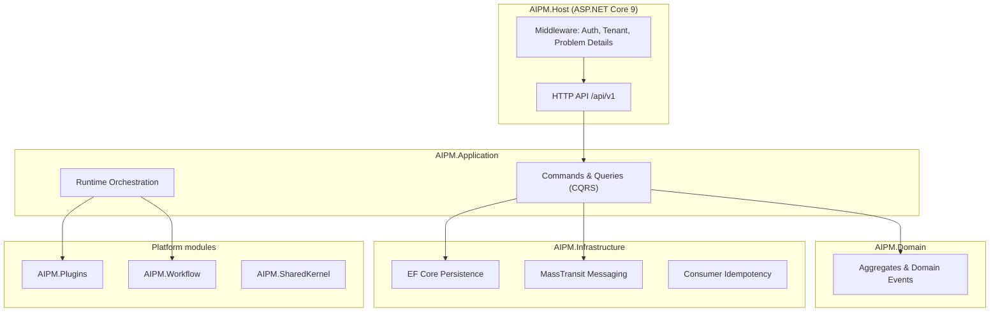

# AI Project Manager (AIPM)

[](https://dotnet.microsoft.com/)
[](LICENSE)
[](https://github.com/MUKHTIARSHAH/AI-Project-Manager/actions/workflows/ci.yml)
[](docs/development/milestone-progress.md)
[](https://github.com/MUKHTIARSHAH/AI-Project-Manager/releases/tag/v0.2.1-foundation-freeze)
[](https://github.com/MUKHTIARSHAH/AI-Project-Manager/commits/main)

**AI Project Manager (AIPM) is an open-source enterprise AI orchestration platform** built with ASP.NET Core, Clean Architecture, Domain-Driven Design (DDD), CQRS, MediatR, and event-driven architecture. It is designed to coordinate AI agents, human approvals, and software delivery through audit-grade governance.

> **Current release:** [`v0.2.1-foundation-freeze`](https://github.com/MUKHTIARSHAH/AI-Project-Manager/releases/tag/v0.2.1-foundation-freeze) — Phase 1 platform + BC-10 Identity & Access Core + hardening sprint. Foundation is **frozen** before P2-M2.

---

## Project status

- **Current version:** `v0.2.1-foundation-freeze`
- **Current phase:** Phase 2 - BC-01 Portfolio and Project Core (planned)
- **Status:** Actively developed

---

## What is AIPM?

AIPM is the **authoritative control plane** for an AI software company. It does not generate customer application code. Instead it:

- Maintains delivery state (requirements, plans, work items, releases)
- Enforces policies and quality gates before production
- Coordinates human approvals and autonomous agent workflows
- Integrates with enterprise SDLC tools
- Produces compliance and audit evidence

The implementation follows a locked **Engineering Blueprint** (SRS, SAD, EIM, Domain Model, ADRs) under `Engineering-Blueprint/`.

## Why it exists

Traditional project management tools were not designed for **autonomous AI contributors** operating under enterprise governance. AIPM addresses:

| Problem | AIPM approach |
|---------|---------------|
| Fragmented delivery state | Single system of record (authoritative state machine) |
| Unsafe autonomous deployment | Fail-closed policy engine + mandatory production gates |
| Vendor lock-in on AI | Model-agnostic provider abstraction |
| Multi-tenant enterprise needs | Tenant isolation, RBAC, audit trails |
| Uncontrolled agent blast radius | Isolated agent runtimes + task-scoped credentials |

---

## Architecture

Clean Architecture with DDD bounded contexts, CQRS (MediatR), and event-driven integration.



**Dependency rule:** Domain has no infrastructure references. Enforced by **7 NetArchTest rules** in CI.

| Layer | Project | Responsibility |
|-------|---------|----------------|
| Host | `AIPM.Host` | Composition root, HTTP endpoints, middleware |
| Application | `AIPM.Application` | Use cases, CQRS handlers, orchestration |
| Domain | `AIPM.Domain` | Aggregates, value objects, domain events |
| Infrastructure | `AIPM.Infrastructure` | EF Core, MassTransit, repositories |
| Shared | `AIPM.SharedKernel` | Cross-cutting primitives, execution context |
| Plugins | `AIPM.Plugins` | Agent plugin loading and manifests |
| Workflow | `AIPM.Workflow` | Workflow runtime contracts |

---

## Technology stack

Locked by [ADR-TECH-001](Engineering-Blueprint/02-Architecture/ADR/ADR-TECH-001-Approved-Technology-Stack.md):

| Area | Technology |
|------|------------|
| Backend | C# / .NET 9 / ASP.NET Core 9 |
| Patterns | Clean Architecture, DDD, CQRS, MediatR |
| Database | PostgreSQL 16+ (`aipm_dev` local identity); SQLite in-memory for unit tests |
| Cache | Redis |
| Messaging | RabbitMQ (MassTransit) |
| Frontend | Next.js (TypeScript) — minimal admin shell |
| Cloud | Azure (primary) |
| Testing | xUnit, FluentAssertions, NetArchTest |
| CI | GitHub Actions |

---

## Current milestone

| Phase | Milestone | Status |
|-------|-----------|--------|
| Phase 1 | M1–M6 Platform infrastructure | **Complete** |
| Phase 2 | P2-M1 BC-10 Identity & Access Core | **Complete** |
| Phase 2 | Pre-P2-M2 Hardening (H-01–H-09) | **Complete** |
| Phase 2 | P2-M2 (BC-01+) | **Not started** |

**Latest capability:** Tenant/user/role/permission management with fail-closed API authorization, tenant-scoped execution context, EF Core migrations, and integration event publishing.

Details: [docs/development/milestone-progress.md](docs/development/milestone-progress.md) · [CHANGELOG.md](CHANGELOG.md)

---

## Roadmap

| Upcoming | Description |
|----------|-------------|
| **P2-M2** | Next business bounded context per approved Phase 2 plan |
| **PostgreSQL identity** | Production persistence path (ADR-TECH-001) |
| **Enterprise SSO** | OAuth/OIDC integration |
| **Admin UI** | Expanded Next.js console |
| **Agent providers** | Real LLM integration after dummy-agent vertical slice |

Full blueprint roadmap: [Engineering-Blueprint/README.md](Engineering-Blueprint/README.md)

---

## Quick start

### Prerequisites

- [.NET 9 SDK](https://dotnet.microsoft.com/download)
- [Docker Desktop](https://www.docker.com/products/docker-desktop/) (PostgreSQL, Redis, RabbitMQ)

### Clone and run

```bash
git clone https://github.com/MUKHTIARSHAH/AI-Project-Manager.git
cd AI-Project-Manager

# Optional: start backing services
./scripts/dev-up.ps1   # Windows PowerShell

cd src
dotnet restore AIPM.sln
dotnet build AIPM.sln -c Release
dotnet test AIPM.sln -c Release
```

### Configure user secrets (required for local API)

```bash
cd src/AIPM.Host

# PostgreSQL identity store (development)
dotnet user-secrets set "ConnectionStrings:IdentityDb" "Host=localhost;Port=5432;Database=aipm_dev;Username=postgres;Password=YOUR_PASSWORD"
dotnet user-secrets set "Security:ApiKey" "dev-local-bc10-key"
```

First-time database setup:

```powershell
$env:AIPM_POSTGRES_PASSWORD = 'YOUR_PASSWORD'
.\scripts\provision-aipm-dev-db.ps1
```

```bash
cd ..
dotnet run --project AIPM.Host
```

### Verify endpoints

| Endpoint | Auth | Description |
|----------|------|-------------|
| `GET /health` | None | Liveness probe |
| `GET /ready` | None | Readiness probe |
| `GET /api/v1/platform/ping` | None | Platform ping |
| `GET /api/v1/identity/tenants` | `X-Api-Key` | List tenants (BC-10) |

Full guide: [docs/development/README.md](docs/development/README.md)

---

## Test commands

```bash
# All tests (76 total: 7 arch + 47 shared + 22 host)
dotnet test src/AIPM.sln -c Release

# Format check (enforced in CI)
dotnet format src/AIPM.sln --verify-no-changes

# Build only
dotnet build src/AIPM.sln -c Release
```

| Suite | Tests | Focus |
|-------|-------|-------|
| `AIPM.Architecture.Tests` | 7 | Clean Architecture boundary rules |
| `AIPM.SharedKernel.Tests` | 47 | Domain, messaging, identity, plugins |
| `AIPM.Host.Tests` | 22 | API integration, tenant scope, auth |

---

## Project structure

```
AI-Project-Manager/
├── src/                          # .NET solution (Clean Architecture)
│   ├── AIPM.Host/                # ASP.NET Core host
│   ├── AIPM.Application/         # CQRS handlers, use cases
│   ├── AIPM.Domain/              # Domain model
│   ├── AIPM.Infrastructure/    # EF Core, MassTransit, repos
│   ├── AIPM.SharedKernel/        # Shared primitives
│   ├── AIPM.Plugins/             # Plugin loader
│   └── AIPM.Workflow/            # Workflow runtime
├── tests/                        # Unit, integration, architecture tests
├── docs/                         # Implementation documentation
├── deploy/                       # Docker Compose, deployment profiles
├── apps/admin-console/           # Next.js admin shell (minimal)
├── Engineering-Blueprint/        # Locked specifications (SRS, SAD, ADRs)
├── .github/workflows/            # CI (build, test, format, coverage)
└── CHANGELOG.md
```

---

## Quality gates

Every milestone and CI run validates:

1. `dotnet build src/AIPM.sln -c Release`
2. `dotnet test src/AIPM.sln -c Release`
3. `dotnet format src/AIPM.sln --verify-no-changes`
4. Architecture tests (NetArchTest)
5. No secrets in committed configuration

See [docs/development/milestone-quality-gate.md](docs/development/milestone-quality-gate.md).

---

## Documentation

| Document | Purpose |
|----------|---------|
| [CHANGELOG.md](CHANGELOG.md) | Implementation changelog |
| [docs/development/](docs/development/) | Milestone docs and dev guide |
| [Engineering-Blueprint/](Engineering-Blueprint/) | Authoritative specifications |
| [docs/adr/](docs/adr/) | Implementation decision log |
| [docs/github-setup.md](docs/github-setup.md) | GitHub repo configuration checklist |

---

## Contributing

Contributions, suggestions, and discussions are welcome.

If you'd like to contribute:

1. Fork the repository
2. Create a feature branch
3. Follow the project's coding standards
4. Ensure all quality gates pass
5. Submit a pull request

Before submitting:

- `dotnet build src/AIPM.sln -c Release`
- `dotnet test src/AIPM.sln -c Release`
- `dotnet format src/AIPM.sln --verify-no-changes`

Please open an issue first for significant architectural or feature changes.

---

## License

[Apache License 2.0](LICENSE)

---

## Maintainer

Mukhtiar Shah

GitHub: [https://github.com/MUKHTIARSHAH](https://github.com/MUKHTIARSHAH)
